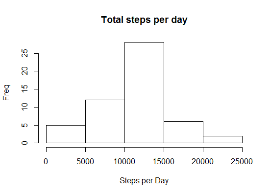
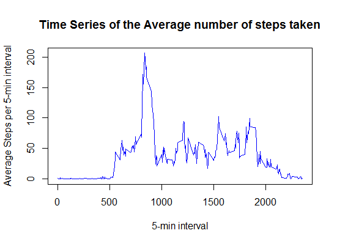
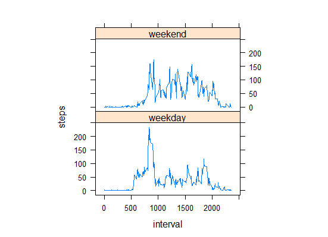

## Loading and preprocessing the data
```{r, cache=TRUE}
source("R_week2.R")
```

-Loading and preprocessing the data
 
```{r, echo=TRUE} 
 activity<- read.csv("activity.csv", sep = ";", header=TRUE)
```

-checking the dataset variables

```{r, echo=TRUE} 
names(activity)

```
-checking the type data

```{r, echo=TRUE}
 str(activity)
```

-checking the dataset head and tail
```{r, echo=TRUE}
head(activity)
tail(activity)
```
-getting a summary of the dataset.
```{r, echo=TRUE}
summary(activity)
```


Process/transform the data (if necessary) into a format suitable for your analysis

```{r, echo=TRUE}
activity <- transform(activity, date = as.Date(date, "%Y-%m-%d"))
```


## What is mean total number of steps taken per day?
```{r, echo=TRUE}
data_dailysummary <- aggregate(steps ~ date, data = activity, sum, na.rm = TRUE)
```

-Plotting a histogram to visualize the distribution of the total number of steps per day

```{r, echo=TRUE}
hist(data_dailysummary$steps, 
     main = "Total steps per day", 
     xlab = "Steps per Day", 
     ylab="Freq", 
     col = "white")
```
 

-Calculate and report the mean and median of the total number of steps taken per day
```{r, echo =TRUE}
mean_steps=mean(data_dailysummary$steps)
median_steps=median(data_dailysummary$steps)
```


## What is the average daily activity pattern?

Time Series of the Average number of steps taken

```{r, echo =TRUE}
time_series_data <- tapply(activity$steps, activity$interval, mean, na.rm = TRUE)


plot(row.names(time_series_data), time_series_data, 
     type = "l", 
     xlab = "5-min interval", 
     ylab = "Average Steps per 5-min interval", 
     main = "Time Series of the Average number of steps taken", 
     col = "blue")
```

 


The 5-minute interval that, on average, contains the maximum number of steps
```{r, echo =TRUE}
max_steps_interval <- which.max(time_series_data)

names(max_steps_interval)
```
## [1] "835"

## Imputing missing values

Using the approach to calculate the mean of the number of steps by 5-min interval
```{r, echo =TRUE}
StepsAverageByInterval <- aggregate(steps ~ interval, data = activity, FUN = mean)
```
Then creating a function to fill the average of steps at the intervals with value NA of the dataset with all observations
```{r, echo =TRUE}
NAFill <- numeric()
for (i in 1:nrow(activity)) {
  xi <- activity[i, ]
  if (is.na(xi$steps)) {
    steps <- subset(StepsAverageByInterval, interval == xi$interval)$steps
  } else {
    steps <- xi$steps
  }
  NAFill <- c(NAFill, steps)
}

activity_NAfilled <- activity
activity_NAfilled$steps <- NAFilling
```

histogram of the total number of steps taken each day after missing values are imputed
```{r, echo =TRUE}
TotalSteps <- aggregate(steps ~ date, data = activity_NAfilled, sum, na.rm = TRUE)

hist(TotalSteps$steps, main = "Daily Total Steps", xlab = "Steps per Day", col = "white")
```
 

## Are there differences in activity patterns between weekdays and weekends?


Panel plot comparing the average number of steps taken per 5-minute interval across weekdays and weekends
```{r, echo =TRUE}
activity$day=ifelse(as.POSIXlt(as.Date(activity$date))$wday%%6==0,
                          "weekend","weekday")
                          ```
 For Sunday and Saturday : weekend, Other days : weekday 
```{r, echo =TRUE}
activity$day=factor(activity$day,levels=c("weekday","weekend"))
```
 first add a character column for day of the week
```{r, echo =TRUE}
library(Hmisc)
summary(activity)

stepsInterval2=aggregate(steps~interval+day,activity,mean)

xyplot(steps~interval|factor(day),data=stepsInterval2,aspect=1/2,type="l")
```

.